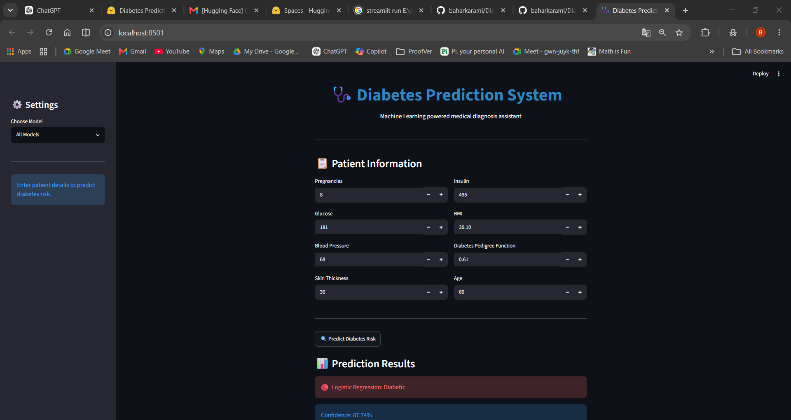

# Diabetes Prediction System (Machine Learning + Streamlit)

An end-to-end **Machine Learning web application** for predicting diabetes based on patient medical data.

Built with multiple ML models and deployed using **Streamlit** for real-time inference.

---

##  Live Demo

```
https://huggingface.co/spaces/baharkarami/gold-agent
```

---

##  Application Preview

<p align="center">
  
</p>

---

## Project Overview

This project predicts whether a patient is diabetic or not based on medical features such as glucose level, BMI, age, and more.

It includes:
- Data preprocessing & cleaning
- Training multiple ML models
- Model comparison
- Interactive UI using Streamlit
- Real-time prediction system

---

## Machine Learning Models Used

The following models were trained and evaluated:

- Logistic Regression
- Random Forest Classifier
- Support Vector Machine (SVM)
- Gradient Boosting Classifier
- XGBoost Classifier

Each model was saved using `joblib` and used for inference in the web app.

---

## Dataset

The project is based on the **Pima Indians Diabetes Dataset**.

### Features:
- Pregnancies
- Glucose
- Blood Pressure
- Skin Thickness
- Insulin
- BMI
- Diabetes Pedigree Function
- Age

### Target:
- `0` → Non-Diabetic
- `1` → Diabetic

---

##  Project Structure

```
Diabetes-Prediction/
│
├── streamlit_app.py
├── requirements.txt
├── README.md
├── .gitignore
│
├── models/
│   ├── *.pkl
│
├── images/
│   └── app.png
│
└── notebooks/
    ├── diabetes_prediction.ipynb
    └── diabetes_predictor
```

---

## Installation & Setup

### 1. Clone the repository
```bash
git clone https://github.com/baharkarami/diabetes-prediction.git
cd diabetes-prediction
```

---

### 2. Create virtual environment (optional but recommended)

```bash
python -m venv venv
source venv/bin/activate   # Mac/Linux
venv\Scripts\activate      # Windows
```

---

### 3. Install dependencies

```bash
pip install -r requirements.txt
```

---

### 4. Run the application

```bash
streamlit run streamlit_app.py
```

Then open:
```
http://localhost:8501
```

---

## Model Workflow

1. Load dataset
2. Preprocess data
3. Train multiple ML models
4. Evaluate performance
5. Save best models using `joblib`
6. Load models in Streamlit app
7. Predict real-time user input

---

## Evaluation Metrics

Models were evaluated using:

- Accuracy
- Precision
- Recall
- F1-score
- Confusion Matrix
- Classification Report

---

## Tech Stack

- Python 
- Pandas & NumPy
- Scikit-learn
- XGBoost
- Streamlit
- Matplotlib & Seaborn
- Joblib

---

## Key Features

- Multi-model prediction system
- Real-time user input interface
- Clean and simple UI with Streamlit
- Lightweight and fast inference
- Easily extendable for future improvements

---


## Author
**Bahar Karami**


---

## If you like this project

If this project helps you, consider giving it a ⭐ on GitHub.

---

## License

This project is for educational purposes.